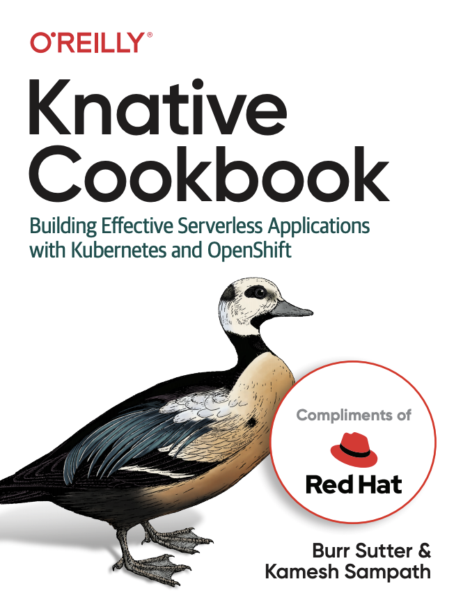

# Knative Tutorial - Introduction to Knative

    

---
## Documentation

 * HTML https://redhat-developer-demos.github.io/knative-tutorial

---
## What is Serverless

 Serverless epitomize the very benefits of what cloud platforms promise: offload the management of infrastructure while taking advantage of a consumption model for the actual utilization of services. While there are a number of server frameworks out there, [Knative](https://knative.dev) is the first serverless platform specifically designed for Kubernetes and OpenShift.

 This tutorial will act as step-by-step guide in helping you to understand Knative starting with setup, understanding fundamentals concepts such as service, configuration, revision etc., and finally deploying some use cases which could help deploying serverless applications.

---
## Contributing

 Please refer to the [how to contribute?](./CONTRIBUTING.md) on how you can contribute to the tutorial

 ---
## 🦸 Author
---
<a href="#">
 
 

Made by Douglas Souza 👋🏽 Get in touch!

 

---
## README versions

[English 🇺🇸](./README.md)
